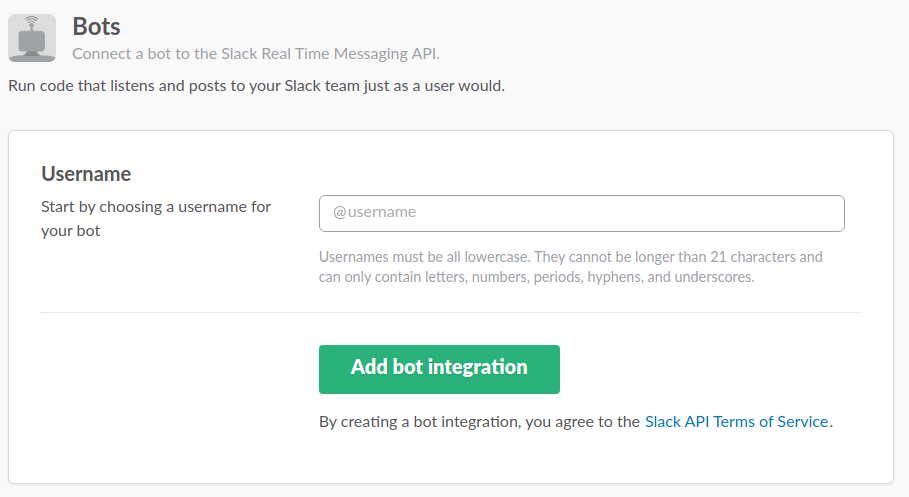
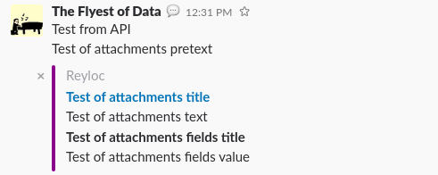

# slack-wrapper
Simple Slack API wrapper for ruby

This README is still a work in progress. I will add more to it as time permits.

* [Installation](https://github.com/reyloc/slack-wrapper#installation)
* [Usage](https://github.com/reyloc/slack-wrapper#usage)
  * [Create the bot and get a token](https://github.com/reyloc/slack-wrapper#create-the-bot-and-get-a-token)
  * [Get your user's API token](https://github.com/reyloc/slack-wrapper#get-your-users-api-token)
  * [Using the API token](https://github.com/reyloc/slack-wrapper#using-the-api-token)
  * [Channels](https://github.com/reyloc/slack-wrapper#channels)
    * [Listing all Channels](https://github.com/reyloc/slack-wrapper#listing-all-channels)
    * [Searching Channels](https://github.com/reyloc/slack-wrapper#searching-channels)
    * [Archiving/Creating Channels](https://github.com/reyloc/slack-wrapper#archivingcreating-channels)
    * [Getting Channel Info](https://github.com/reyloc/slack-wrapper#getting-channel-info)
    * [Getting Channel History](https://github.com/reyloc/slack-wrapper#getting-channel-history)
    * [Joining/Leaving a Channel](https://github.com/reyloc/slack-wrapper#joiningleaving-a-channel)
    * [Inviting/Kicking a user to/from a Channel](https://github.com/reyloc/slack-wrapper#invitingkicking-a-user-tofrom-a-channel)
    * [Renaming a Channel](https://github.com/reyloc/slack-wrapper#renaming-a-channel)
    * [Setting Channel Purpose and Topic](https://github.com/reyloc/slack-wrapper#setting-channel-purpose-and-topic)
  * [Chat](https://github.com/reyloc/slack-wrapper#chat)
    * [Post Standard Message](https://github.com/reyloc/slack-wrapper#post-standard-message)
    * [Post /me Message](https://github.com/reyloc/slack-wrapper#post-me-message)
    * [Post Ephemeral Message](https://github.com/reyloc/slack-wrapper#post-ephemeral-message)
    * [Post Message w/ Attachment](https://github.com/reyloc/slack-wrapper#post-message-w-attachment)
    * [Update Message](https://github.com/reyloc/slack-wrapper#update-message)
    * [Delete Message](https://github.com/reyloc/slack-wrapper#delete-message)
  * [Files](https://github.com/reyloc/slack-wrapper#files)
    * [List Files](https://github.com/reyloc/slack-wrapper#list-files)
    * [Search for a File](https://github.com/reyloc/slack-wrapper#search-for-a-file)
    * [Delete a File](https://github.com/reyloc/slack-wrapper#delete-a-file)
    * [Upload a File](https://github.com/reyloc/slack-wrapper#upload-a-file)
    * [Add a File Comment](https://github.com/reyloc/slack-wrapper#add-a-file-comment)
    * [Delete a File Comment](https://github.com/reyloc/slack-wrapper#delete-a-file-comment)
    * [Edit a File Comment](https://github.com/reyloc/slack-wrapper#edit-a-file-comment)
    * [Editing File URL properties](https://github.com/reyloc/slack-wrapper#editing-file-url-properties)
  * [Using RTM](https://github.com/reyloc/slack-wrapper/blob/master/README.md#using-rtm)
* [License](https://github.com/reyloc/slack-wrapper#license)

## Installation
You can install the gem via:
```
gem install slack-wrapper
```
If you wish, you could install pull the source code from here and install it locally:
```
git clone git@github.com:reyloc/slack-wrapper.git
cd slack-wrapper
gem build slack-wrapper.gemspec
gem install slack-wrapper-0.0.1.gem
```

## Usage

### Create the bot and get a token

Go to [this link](https://my.slack.com/services/new/bot) to create a new bot.



From there you will be brought to a page where you can edit the bot name and other such settings. The API key is the important part here, so make sure to copy somewhere safe.

### Get your user's API token

Go to [this link](https://api.slack.com/custom-integrations/legacy-tokens) to get a legacy token (you could go through the whole [Oauth2](https://api.slack.com/docs/oauth) process instead to get a token if you wish). From there, click to get an API token issued and copy it somewhere safe.

### Using the API token
To use your Slack API token, you simply use coding such as this:
```
require 'slack-wrapper'
Slack.configure do |config|
  config.token = 'YOUR TOKEN HERE'
end
```
Replacing YOUR TOKEN HERE with your actual Slack API token.

### Channels

#### Listing all Channels

To get a list of all channels, you will use the ```Slack::API::Channels.get_channels``` function. This takes one option argument to determine if you want archived channels included.

Archive channels excluded:
```
Slack::API::Channels.get_channels
```
Archive channels included:
```
Slack::API::Channels.get_channels(true)
```
The full code would look like this:
```
require 'slack-wrapper'
Slack.configure do |config|
  config.token = 'YOUR TOKEN HERE'
end
channels = Slack::API::Channels.get_channels
```
The return is an array of [channel objects](https://api.slack.com/types/channel) that have been made into Hashes for your convenience. You could use this to then print out all channel names if you so wished:
```
channels.each do |channel|
  puts channel['name']
end
```

#### Searching Channels

To search through all channels, you will use the ```Slack::API::Channels.search``` function. This takes 1 mandatory option and two optional ones:

Option Name | Mandatory?           | Description
------------|----------------------|--------------------------
search      | Yes                  | The search term
archived    | No, default is false | Search archived channels
regex       | No, default is false | Do a regex search

To search for an active channel named 'bacon' we would use coding like:

```
require 'slack-wrapper'
Slack.configure do |config|
  config.token = 'YOUR TOKEN HERE'
end
channel = Slack::API::Channels.search('bacon')
```

This will return a [channel object](https://api.slack.com/types/channel) that has been made into Hashes for your convenience. If you did a regex search, you instead get an array of [channel objects](https://api.slack.com/types/channel) that have been made into Hashes for your convenience

#### Archiving/Unarchiving Channels

To archive or unarchive a channel, you will need the Channel ID. This can be obtained via a [channel object](https://api.slack.com/types/channel), such as the one you get from [Searching Channels](https://github.com/reyloc/slack-wrapper#searching-channels). To do this, you will use the ```Slack::API::Channels.archive``` and ```Slack::API::Channels.unarchive``` functions. These take 1 mandatory option (namely the Channel ID):

```
require 'slack-wrapper'
Slack.configure do |config|
  config.token = 'YOUR TOKEN HERE'
end
archived = Slack::API::Channels.archive('C516PHW2C')
puts "Channel C516PHW2C archived" if archived
unarchived = Slack::API::Channels.unarchive('C516PHW2C')
puts "Channel C516PHW2C unarchived" if unarchived
```

Both functions return ```true``` or ```false``` to represent if the action succeeded or not. 

#### Creating Channels

To create a channel, you will use the ```Slack::API::Channels.create``` function. This takes 1 mandatory argument (the name of the new channel) and one optional boolean argument. The optional boolean argument tells the Slack API whether it should validate the channel name given or not. What this means is it will change the channel name to meet requirements if needed. By default, this optional argument is set to ```false```.

```
require 'slack-wrapper'
Slack.configure do |config|
  config.token = 'YOUR TOKEN HERE'
end
channel = Slack::API::Channels.create('hamsammich')
```

This will return a [channel object](https://api.slack.com/types/channel) that has been made into Hashes for your convenience.

#### Getting Channel Info

To get a [channel object](https://api.slack.com/types/channel) converted into a Hash for your convenience, you will use the ```Slack::API::Channels.info``` function. This function takes 1 mandatory argument (the Channel ID).

```
require 'slack-wrapper'
Slack.configure do |config|
  config.token = 'YOUR TOKEN HERE'
end
channel = Slack::API::Channels.info('C516PHW2C')
```

#### Getting Channel History

To get a history of all channel activity, you will use the ```Slack::API::Channels.history``` function. This takes 2 mandatory arguments:

Argument | Meaning                   | Type
---------|---------------------------|--------
id       | The Channel ID            | String
count    | Number of items to return | Integer

Keep in mind the more returned, the longer the query will take. It looks like this:

```
require 'slack-wrapper'
Slack.configure do |config|
  config.token = 'YOUR TOKEN HERE'
end
history = Slack::API::Channels.history('C516PHW2C', 100)
```

This will return an array of [message objects](https://api.slack.com/events/message) converted into Hashes for your convenience.

#### Joining/Leaving a Channel

To join a channel, you will use the ```Slack::API::Channels.join``` function, which uses 1 mandatory variable (the channel name). To leave a channel, you instead use the ```Slack::API::Channels.leave``` function, which uses 1 mandatory variable (the channel ID). 

```
require 'slack-wrapper'
Slack.configure do |config|
  config.token = 'YOUR TOKEN HERE'
end
puts "Left Channel C516PHW2C" if Slack::API::Channels.leave('C516PHW2C')
puts "Joined Channel bacon" if Slack::API::Channels.join('bacon')
```

Both return a boolean to indicate if the attempted action was successful.

#### Inviting/Kicking a user to/from a Channel

Inviting or kicking a user from a channel will require the User ID and Channel ID. The functions for these are ```Slack::API::Channels.invite_user``` and ```Slack::API::Channels.kick_user``` respectively. They both require 2 mandatory arguments, namely the User ID and Channel ID.

```
require 'slack-wrapper'
Slack.configure do |config|
  config.token = 'YOUR TOKEN HERE'
end
puts "Invited User U458DEQKW to Channel C516PHW2C" if Slack::API::Channels.invite_user('U458DEQKW', 'C516PHW2C')
puts "Kick User U458DEQKW from Channnel C516PHW2C" if Slack::API::Channels.kick_user('U458DEQKW', 'C516PHW2C')
```

Both return a boolean to indicate if the attempted action was successful.

#### Renaming a Channel

To rename a channel, you will use the ```Slack::API::Channels.rename``` function. This takes 2 mandatory variables, namely the Channel ID and the new name to use. 

```
require 'slack-wrapper'
Slack.configure do |config|
  config.token = 'YOUR TOKEN HERE'
end
puts "Renamed Channel C516PHW2C to pizza" if Slack::API::Channels.rename('C516PHW2C', 'pizza')
```

This returns a boolean to indicate if the attempted action was successful.

#### Setting Channel Purpose and Topic

To set a Channel's purpose or topic, you will use the functions ```Slack::API::Channels.set_pupose``` and ```Slack::API::Channels.set_topic``` respectively. Both take 2 mandatory arguments, namely the Channel ID and the text to use:

```
require 'slack-wrapper'
Slack.configure do |config|
  config.token = 'YOUR TOKEN HERE'
end
puts "Channel C516PHW2C purpose now 'Nomnomnom'" if Slack::API::Channels.set_topic('C516PHW2C', 'Nomnomnom')
puts "Channel C516PHW2C topic now 'Food'" if Slack::API::Channels.set_topic('C516PHW2C', 'Food')
```

Both return a boolean to indicate if the attempted action was successful.

### Chat

#### Post Standard Message

To post a standard message, you will use the ```Slack::API::Chat.post``` function, which takes 2 mandatory arguments (text to post and Channel ID) and 1 optional argument (an object containing various options for the post). 

```
require 'slack-wrapper'
Slack.configure do |config|
  config.token = 'YOUR TOKEN HERE'
end
puts "Posted in channel" if Slack::API::Chat.post('Hello!', 'C516PHW2C')
```

This returns a boolean to indicate if the attempted action was successful.

#### Post /me Message

To post a /me message, you will use the ```Slack::API::Chat.post_me``` function, which takes 2 mandatory arguments (text to post and Channel ID). If you are not familiar with /me messages, they look like this:


```
require 'slack-wrapper'
Slack.configure do |config|
  config.token = 'YOUR TOKEN HERE'
end
puts "Posted in channel" if Slack::API::Chat.post_me('is doing just fine', 'C516PHW2C')
```

This returns a boolean to indicate if the attempted action was successful.

#### Post Ephemeral Message

To post an ephemeral message, you will use the ```Slack::API::Chat.post_ephemeral``` function, which takes 3 mandatory arguments (text to post, Channel ID, and User ID) and 1 optional argument (an object containing various options for the post). If you are not familiar with ephemeral messages, they look like this:


```
require 'slack-wrapper'
Slack.configure do |config|
  config.token = 'YOUR TOKEN HERE'
end
puts "Posted in channel" if Slack::API::Chat.post_ephemeral('Hello back!', 'C516PHW2C', 'U458DEQKW')
```

This returns a boolean to indicate if the attempted action was successful.

#### Post Message w/ Attachment

To post a message in Slack that contains a [message attachment](https://api.slack.com/docs/message-attachments), you will use the optional argument available in the ```Slack::API::Chat.post``` and ```Slack::API::Chat.post_ephemeral``` functions. If you are unfamiliar with Slack message attachments, they look like this:



To do this, you will need to write out the attachment object:

```
require 'slack-wrapper'
Slack.configure do |config|
  config.token = 'YOUR TOKEN HERE'
end
obj = ['fallback'    => 'Test of attachments fallback',
       'color'       => '#8B008B',
       'pretext'     => 'Test of attachments pretext',
       'author_name' => 'Reyloc',
       'author_link' => 'https://github.com/reyloc',
       'title'       => 'Test of attachments title',
       'title_link'  => 'https://api.slack.com/',
       'text'        => 'Test of attachments text',
       'fields'      => [
         {
           'title' => 'Test of attachments fields title',
           'value' => 'Test of attachments fields value',
           'short' => false
         }
        ]
      ]
puts "Posted in channel" if Slack::API::Chat.post('Test from API', 'C516PHW2C')
```

#### Update Message

To update a message in Slack, you will use the ```Slack::API::Chat.update``` function. This function takes 3 mandatory arguments (text to use, timestamp of the message, channel ID) and 1 optional argument (an object containing various options for the post):

```
require 'slack-wrapper'
Slack.configure do |config|
  config.token = 'YOUR TOKEN HERE'
end
puts "Message updated" if Slack::API::Chat.update('Nevermind', '1355517523.000005', 'C516PHW2C')
```

This returns a boolean to indicate if the attempted action was successful.

#### Delete Message

To delete a message in Slack, you will use the ```Slack::API::Chat.delete``` function. This function takes 2 mandatory arguments ( timestamp of the message, channel ID):

```
require 'slack-wrapper'
Slack.configure do |config|
  config.token = 'YOUR TOKEN HERE'
end
puts "Message deleted" if Slack::API::Chat.delete('1355517523.000005', 'C516PHW2C')
```

This returns a boolean to indicate if the attempted action was successful.

### Files

#### List Files

To get all files uploaded into Slack, you will use the ```Slack::API::Files.get_files``` function. This takes 1 optional argument, which is a comma separated `String` containing all the file types to look for. By default, this optional argument will look for all filetypes.

```
require 'slack-wrapper'
Slack.configure do |config|
  config.token = 'YOUR TOKEN HERE'
end
files = Slack::API::Files.get_files
pdfs = Slack::API::Files.get_files('pdfs')
zips_and_images = Slack::API::Files.get_files('zips,images')
not_zips = Slack::API::Files.get_files('spaces,snippets,images,gdocs,pdfs')
```

This returns an array of [file objects](https://api.slack.com/types/file) converted into Hashes for your convenience.

#### Search for a File

To search through all files, you will use the ```Slack::API::Files.search``` function. This takes 1 mandatory option and two optional ones:

Option Name | Mandatory?           | Description
------------|----------------------|--------------------------
term        | Yes                  | The search term
regex       | No, default is false | Do a regex search

To search for an active channel named 'bacon' we would use coding like:

```
require 'slack-wrapper'
Slack.configure do |config|
  config.token = 'YOUR TOKEN HERE'
end
files = Slack::API::Files.search('bacon', true)
```

This will return a [file object](https://api.slack.com/types/file) that has been made into Hashes for your convenience. If you did a regex search, you instead get an array of [file objects](https://api.slack.com/types/file) that have been made into Hashes for your convenience

#### Delete a File

To delete a file, you will use the ```Slack::API::Files.delete``` function, which takes 1 mandatory argument (the file ID):

```
require 'slack-wrapper'
Slack.configure do |config|
  config.token = 'YOUR TOKEN HERE'
end
puts "File F2147483862 deleted" if Slack::API::Files.delete('F2147483862')
```

This returns a boolean to indicate if the attempted action was successful.

#### Upload a File

To upload a file, you will use the ```Slack::API::Files.upload``` function, which takes 2 mandatory arguments (path/to/file and a `String` of comma separated Channel IDs) and 1 optional argument (options to use for the upload). While it is technically required for file uploads, it is highly recommend you add options into your upload.

Name            | Description
----------------|-------------------------------------------------------
channels        | Comma seperated channel IDs, added for you
title           | The Title of file, defaults to the filename
filename        | The name of the file, defaults to the filename
filetype        | The type of file, defaults to auto 
initial_comment | The first comment on file, defaults to a blank String

```
require 'slack-wrapper'
Slack.configure do |config|
  config.token = 'YOUR TOKEN HERE'
end
puts "File uploaded" if Slack::API::Files::Upload.new('/home/jcolyer/Pictures/usopp.jpg', 'C516PHW2C,C716QAB2D', {
  :filetype => 'auto',
  :title    => 'Usopp the Great',
  :initial_comment => 'Testing comment'
})
```

This returns a boolean to indicate if the attempted action was successful.

#### Add a File Comment

To add a comment to a file, you will use the ```Slack::API::Files.add_comment``` function, which takes 2 mandatory arguments (text for comment and the file ID):

```
require 'slack-wrapper'
Slack.configure do |config|
  config.token = 'YOUR TOKEN HERE'
end
file = Slack::API::Files.add_comment('Awesome pic!', 'F71ESBBC5')
```

This returns a [file object](https://api.slack.com/types/file) that has been made into Hashes for your convenience. 

#### Delete a File Comment

To add a comment to a file, you will use the ```Slack::API::Files.delete_comment``` function, which takes 2 mandatory arguments (file ID and comment ID):

```
require 'slack-wrapper'
Slack.configure do |config|
  config.token = 'YOUR TOKEN HERE'
end
file = Slack::API::Files.delete_comment('F71ESBBC5', 'Fc1234567890')
```

This returns a [file object](https://api.slack.com/types/file) that has been made into Hashes for your convenience. 

#### Edit a File Comment

To edit a comment to a file, you will use the ```Slack::API::Files.edit_comment``` function, which takes 3 mandatory arguments (text to use, file ID, and comment ID):

```
require 'slack-wrapper'
Slack.configure do |config|
  config.token = 'YOUR TOKEN HERE'
end
file = Slack::API::Files.edit_comment('Loving it!', 'F71ESBBC5', 'Fc1234567890')
```

This returns a [file object](https://api.slack.com/types/file) that has been made into Hashes for your convenience.

#### Editing File URL properties

When a file is uploaded to Slack, it has a URL parameter that is either publicly available or is not. To edit this setting, we use the ```Slack::API::Files.revoke_URL``` function to revoke the public URL and the ```Slack::API::Files.enable_URL``` function to enable the public URL. Both require 1 mandatory argument (the file ID):

```
require 'slack-wrapper'
Slack.configure do |config|
  config.token = 'YOUR TOKEN HERE'
end
file_one = Slack::API::Files.revoke_URL('F71ESBBC5')
file_two = Slack::API::Files.enable_URL('F82GACDG8')
```

Revoking the URL returns the URL itself while enabling it returns a [file object](https://api.slack.com/types/file) that has been made into Hashes for your convenience.

### Using RTM

This gem includes the two Slack API RTM (real time messaging) functions and can be used for your user/bot to listen and reply  to your slack channels. You can use whatever means you wish to connect and use the websocket link they provide, but my suggestions are [haye-websocket](https://github.com/faye/faye-websocket-ruby) and [EventMachine](https://github.com/eventmachine/eventmachine). Example code of this all in action would be:
```
require 'slack-wrapper'
require 'faye/websocket'
require 'eventmachine'
Slack.configure do |config|
  config.token = 'YOUR TOKEN HERE'
end
if Slack::API::Auth
  wss = Slack::API::RTM.connect
  EM.run do
    ws = Faye::WebSocket::Client.new(wss)
    ws.on :open do |event|
      p [:open]
    end
    ws.on :message do |event|
      data = JSON.parse(event.data)
      if data['type'] == 'message'
        case data['text']
          when "Hello <@#{Slack.id}>"
            Slack::API::Chat.post_ephemeral("Hello back!", data['channel'], data['user'])
          when "How are you <@#{Slack.id}>?"
            Slack::API::Chat.post_me("is doing just fine", data['channel'])
        end
      end
    end
    ws.on :close do |event|
      p [:close, event.code, event.reason]
      ws = nil
    end
  end
end
```
What this will basically do is configure the Slack API token. From there, it will then test if the token is authenticated. If it is, it then generates a websocket URL using the RTM API. It then checks the data coming from the websocket. If the data is a message, it then loops on the entry and checks if the type of message data is a message (meaning someone or something said something in Slack). If it is, it then parses the text of the message. If someone said ```Hello @your_bot``` the bot will post a message saying ```Hello back!``` to the user using ephemeral posting (only that user can see it). Should the text be ```How are you @your_bot?``` the bot will then post a me message (essentially a message prepended with /me) saying it is doing just fine.

## License
This project is licensed under the [MIT License](https://opensource.org/licenses/MIT).
